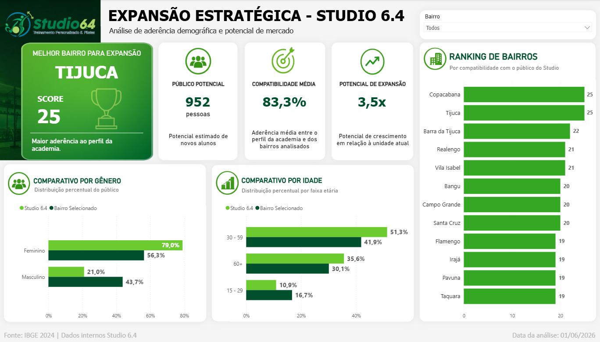

# 📊 Expansão Estratégica da Studio 6.4

  

## 📖 Sobre o Projeto

Este projeto foi desenvolvido como atividade da disciplina de **Big Data**, com o objetivo de aplicar conceitos de análise de dados e Business Intelligence em um cenário real de tomada de decisão.

A proposta consiste em identificar bairros do município do Rio de Janeiro com potencial para receber uma nova unidade da academia **Studio 6.4**, utilizando dados internos da empresa e informações demográficas externas.

Por meio da construção de um dashboard interativo em Power BI, foi possível comparar o perfil atual dos alunos da academia com o perfil populacional de diferentes bairros, auxiliando a definição de regiões mais aderentes ao público-alvo do negócio.

---

## 🛠️ Ferramentas Utilizadas

* Python
* Power BI
* DAX
* Microsoft Excel

---

## 📈 Indicadores Desenvolvidos

### Público Potencial

Estimativa da quantidade de pessoas em cada bairro com características semelhantes ao perfil predominante dos alunos da academia.

### Compatibilidade Média

Mede o grau de aderência entre o perfil demográfico do bairro analisado e o perfil atual dos alunos da Studio 6.4.

### Potencial de Expansão

Representa a oportunidade de crescimento da academia na região, comparando o público potencial identificado com a base atual de alunos.

### Ranking de Bairros

Classificação dos bairros de acordo com os critérios definidos para apoiar a decisão de expansão.

---

## 📊 Dashboard

O painel foi desenvolvido para fornecer uma análise rápida e intuitiva dos bairros avaliados.

### Funcionalidades

* Seleção dinâmica de bairros;
* Ranking dos bairros com maior potencial de mercado;
* Comparação entre o perfil da academia e o perfil do bairro selecionado;
* Comparativo por gênero;
* Comparativo por faixa etária;
* Indicadores estratégicos para tomada de decisão;
* Visualização simplificada dos resultados.

---

## ✅ Resultado

O dashboard desenvolvido permite visualizar rapidamente quais bairros apresentam maior potencial para expansão da Studio 6.4, combinando indicadores quantitativos e comparações demográficas para apoiar decisões estratégicas baseadas em dados.
